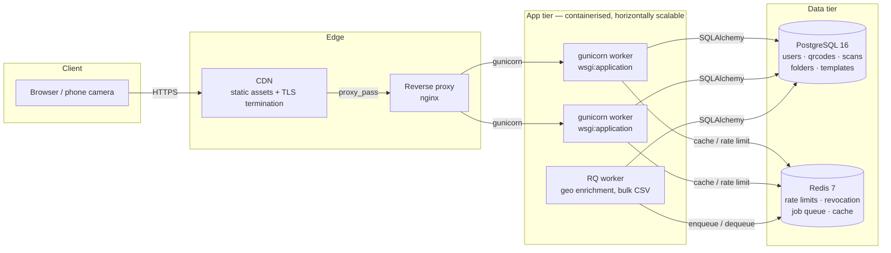

# DRQR — Dynamic QR Code Platform

[](https://github.com/WHITEJACK5/DRQR/actions)
[](https://github.com/WHITEJACK5/DRQR)
[](https://www.python.org/)
[](LICENSE)

A self-hosted QR code generation and analytics platform built with Flask, PostgreSQL, and Redis. Supports 25+ QR types, dynamic retargeting, scan analytics, and a vendor-facing review dashboard.

---

## Table of Contents

- [Features](#features)
- [Technology Stack](#technology-stack)
- [Quick Start](#quick-start)
- [Project Structure](#project-structure)
- [Configuration](#configuration)
- [API Documentation](#api-documentation)
- [Testing](#testing)
- [Deployment](#deployment)
- [Security](#security)
- [Contributing](#contributing)
- [License](#license)

---

## Features

### QR Code Generation
- 25+ QR types: URL, vCard, WiFi, Email, SMS, WhatsApp, Event, Location, Social Media, GS1 Digital Link, and more
- Static and dynamic QR codes with post-generation editing
- Full visual customization: patterns, eye styles, colors, gradients, frame CTA text
- Logo overlay with automatic centering and white rounded background
- Multiple output formats: PNG, SVG, PDF

### Analytics
- Per-QR scan tracking with timestamp, IP, user agent, device, browser, OS, country, and city
- Account-wide analytics overview with timeline, device breakdown, and top-performing codes
- Geo-IP enrichment processed asynchronously off the redirect path

### Review Capture
- Dynamic QR codes of type `review` route customers to a lightweight review form (star rating + free text)
- Sentiment classification per review via a hosted LLM API
- Auto-generated "what customers are saying" summary on the vendor dashboard
- Rating trend over time and flagged negative reviews requiring response

### Authentication and Authorization
- JWT-based authentication with 15-minute access tokens and 30-day refresh tokens
- Token rotation on refresh; compromised tokens can be revoked before natural expiry via a Redis-backed denylist
- TOTP-based two-factor authentication
- Password reset via emailed token
- Authorization boundary tests verifying user A cannot read, update, or delete user B's resources

### Infrastructure
- PostgreSQL via SQLAlchemy ORM with Alembic migrations
- Redis for rate limiting, token revocation, job queue, and read-through caching
- Background job processing via RQ (Redis Queue) with thread-based fallback
- Gunicorn WSGI server behind nginx reverse proxy
- Docker Compose for full-stack local development

---

## Technology Stack

| Layer | Technology |
|---|---|
| Backend | Python 3.11, Flask 3.0 |
| ORM | SQLAlchemy 2.0 |
| Migrations | Alembic 1.14 |
| Database | PostgreSQL 16 (SQLite for local dev) |
| Cache / Queue | Redis 7 |
| Rate Limiting | Flask-Limiter 3.8 |
| Auth | PyJWT 2.8, pyotp |
| QR Rendering | qrcode 8.0, Pillow 10.4, ReportLab 4.2 |
| WSGI Server | Gunicorn 26.2 |
| Reverse Proxy | nginx |
| Object Storage | S3-compatible (AWS S3, Cloudflare R2, Backblaze B2) |
| Monitoring | Sentry SDK, Prometheus metrics endpoint |
| Testing | pytest, pytest-cov, Playwright |

---

## Quick Start

### Prerequisites

- Python 3.11+
- PostgreSQL 16 (optional; SQLite is the default for local development)
- Redis 7 (optional; in-memory fallback is used if not configured)
- Docker and Docker Compose (for containerized setup)

### Local Development

```bash
# Clone the repository
git clone https://github.com/WHITEJACK5/DRQR.git
cd DRQR

# Create a virtual environment
python -m venv .venv
source .venv/bin/activate

# Install dependencies
pip install -r requirements.txt

# Copy and edit the environment file
cp .env.example .env

# Run the development server
python server.py
```

The application will be available at `http://localhost:5000`.

### Docker Compose

```bash
cp .env.example .env
docker compose up --build
```

This starts the application, PostgreSQL, and Redis together.

---

## Project Structure

```
DRQR/
├── app/
│   ├── routes/              # HTTP layer: thin handlers on Blueprints
│   │   ├── auth.py          #   register, login, 2FA, password reset
│   │   ├── qr.py            #   generate, CRUD, download, preview
│   │   ├── analytics.py     #   scan and aggregate analytics
│   │   ├── reviews.py       #   review capture and vendor dashboard
│   │   ├── redirect.py      #   /r/<code> public redirect path
│   │   ├── meta.py          #   health, version, pagination meta
│   │   └── pages.py         #   frontend page serving
│   ├── services/            # Business logic
│   │   ├── render.py        #   QR rendering (patterns, frames, gradients, logos)
│   │   ├── redirect_service.py  # redirect decisions (expiry/limit/password/smart URL)
│   │   ├── geo.py           #   IP geolocation (off the redirect path)
│   │   ├── tokens.py        #   JWT mint/verify, access/refresh pair
│   │   ├── storage.py       #   S3-compatible object storage
│   │   └── llm.py           #   sentiment classification and summary generation
│   ├── repositories/        # All SQL, session-based
│   │   ├── users_repo.py
│   │   ├── qr_repo.py
│   │   ├── scans_repo.py
│   │   ├── folders_repo.py
│   │   └── templates_repo.py
│   ├── models/              # Data models (the schema of record)
│   │   └── entities.py      #   SQLAlchemy ORM declarations
│   ├── utils/               # Pure helpers, no Flask/DB/network
│   │   ├── qr_content.py    #   QR payload construction per type
│   │   ├── validation.py    #   colour parsing, short codes, password checks
│   │   └── device.py        #   user-agent parsing
│   ├── schemas.py           # Pydantic request schemas for every JSON route
│   ├── schemas_out.py       # Pydantic response models
│   ├── db.py                # Engine + session factory, dialect-specific pooling
│   ├── config.py            # Environment + secret bootstrap
│   ├── extensions.py        # App object, CORS, auth decorators, limiter
│   ├── jobs.py              # Background jobs (RQ, thread fallback)
│   ├── cache.py             # Read-through cache (Redis, in-memory fallback)
│   ├── ratelimit.py         # Rate limiting (Redis, in-memory fallback)
│   ├── pagination.py        # Shared limit/offset parsing
│   └── metrics.py           # Prometheus metrics endpoint
├── migrations/              # Alembic: env.py + versions/
├── scripts/
│   ├── pgbackup.py          # pg_dump / pg_restore / verify / rotate
│   └── capture_screenshots.py
├── deploy/
│   ├── nginx.conf           # Reverse proxy configuration
│   ├── DR-backup.service    # Systemd backup unit
│   ├── DR-backup.timer      # Systemd timer (daily at 03:17)
│   └── crontab.example      # Cron fallback for non-systemd hosts
├── frontend/
│   ├── index.html           # Homepage: generator + live preview
│   ├── dashboard.html       # Dashboard: full edit/manage/analytics
│   ├── pricing.html
│   ├── api-docs.html
│   └── manual.html
├── static/
│   ├── css/style.css        # Grid white / black / neon green
│   └── js/
│       ├── app.js           # 25 types, preview, logo, auth
│       └── session.js       # Token storage, renewal, logout
├── tests/                   # Unit + integration; PostgreSQL legs run when TEST_DATABASE_URL is set
├── Dockerfile
├── docker-compose.yml
├── Procfile
├── alembic.ini
├── requirements.txt
└── .env.example
```

---

## Configuration

All configuration is via environment variables. See `.env.example` for the full list with defaults.

| Variable | Required | Default | Purpose |
|---|---|---|---|
| `SECRET_KEY` | Yes | — | Flask session signing key (min 32 chars) |
| `JWT_SECRET` | No | falls back to `SECRET_KEY` | JWT signing key |
| `DATABASE_URL` | No | `sqlite:///data/DR.db` | SQLAlchemy connection string |
| `REDIS_URL` | No | — | Enables Redis-backed rate limiting, job queue, and cache |
| `S3_BUCKET` | No | — | Enables S3-compatible object storage for logos |
| `S3_ENDPOINT_URL` | No | — | Custom S3 endpoint (R2, B2, MinIO) |
| `AWS_REGION` | No | `us-east-1` | AWS region for S3 |
| `AWS_ACCESS_KEY_ID` | No | — | AWS credentials |
| `AWS_SECRET_ACCESS_KEY` | No | — | AWS credentials |
| `SMTP_HOST` | No | — | Enables transactional email |
| `SMTP_PORT` | No | `587` | SMTP port |
| `SMTP_FROM` | No | `no-reply@DRandco.com` | From address for emails |
| `SENTRY_DSN` | No | — | Enables Sentry error tracking |
| `APP_ENV` | No | `development` | Set to `production` for production mode |
| `BASE_URL` | No | `http://localhost:5000` | Public base URL for links |
| `ALLOWED_ORIGINS` | No | localhost origins | Comma-separated CORS origins |
| `PORT` | No | `5000` | HTTP port |
| `WEB_CONCURRENCY` | No | `4` | Gunicorn worker count |
| `DR_TIMEOUT` | No | `60` | Gunicorn request timeout |

### Secrets in production

In staging and production, secrets are injected by the host's secret store as environment variables. The `.env` file is for local development only and is git-ignored.

| Host | Where the secret goes |
|---|---|
| Render | Dashboard, your service, Environment, Add secret |
| Railway | Project, Variables, add `SECRET_KEY` |
| Fly.io | `fly secrets set SECRET_KEY=...` |
| AWS | Secrets Manager / SSM, exported by the task definition |

Generate a key with:

```bash
python -c "import secrets; print(secrets.token_hex(32))"
```

Production refuses to start without `SECRET_KEY` and does not read `.env` at all. If a `.env` file is present, the app logs a warning naming the path.

---

## Observability

### Structured logging

Every log line is JSON: `{"ts": "...", "level": "INFO", "logger": "DR", "service": "DR", "env": "production", "msg": "...", ...}`. Fields passed via `extra=` are promoted to the top level, so they are queryable rather than greppable.

### Metrics

`GET /metrics` serves Prometheus text: request count, a latency histogram, and an error counter, all labelled by route template. A raw path would create a label per QR id and grow without bound.

```yaml
# prometheus.yml
scrape_configs:
  - job_name: DR
    static_configs:
      - targets: ["app:8000"]
```

### Error tracking (Sentry)

Backend and frontend both initialise the SDK when `SENTRY_DSN` is set and is a complete no-op without it, because a missing DSN is the normal state for local development and CI.

### Uptime monitoring

Point any external monitor at `GET /api/health`. It returns `200` with `{"status":"ok",...}` only when the app is up, so a non-200 or a timeout is a real alert.

---

## Tests and Coverage

```bash
pytest -q                                    # SQLite
TEST_DATABASE_URL=postgresql://… pytest -q   # + PostgreSQL legs
pytest -q --cov                              # + coverage, enforced threshold
```

Coverage is enforced at 70%. The floor is deliberately below the measured value so that a new line of legitimate code does not fail the build.

Heavy suites, each with extra tooling and each run by its own CI step:

| Suite | Needs | What it covers |
|---|---|---|
| `tests/test_e2e_playwright.py` | `pip install playwright && playwright install chromium` | Real browser: register, verify from a real email, login, dynamic QR, scan, analytics |
| `tests/test_load_redirect.py` | k6 on PATH | The `/r/<code>` redirect under sustained load, against the thresholds in `loadtests/redirect.js` |

---

## Deployment architecture

See [Architecture](#-architecture) above for the diagram and hop-by-hop explanation.

---

## Pagination

List endpoints use **`limit` / `offset`** (offset pagination):

```bash
GET /api/v1/qrcodes?limit=50&offset=0
GET /api/v1/folders?limit=20&offset=40
GET /api/v1/templates?limit=20&offset=0
GET /api/v1/qrcodes/<id>/analytics?limit=100&offset=0   # the scan list
```

Paginated responses are an envelope:

```json
{ "items": [ ... ], "total": 128, "limit": 50, "offset": 0 }
```

Two behaviours worth knowing:

- **Defaults are backwards compatible.** With no `limit`/`offset`, the collection endpoints return a bare array (the legacy shape older clients depend on). Supply either parameter and you get the envelope. This is a real inconsistency in the API rather than something to hide.
- **Bad input is a 400**, not a silently clamped page: a non-numeric or out-of-range `limit` is rejected.

---

## Deployment architecture



The source of truth is [`docs/architecture.mmd`](docs/architecture.mmd) — GitHub renders it from there, so the diagram is reviewable text and cannot silently drift from the code.

**What each hop is for:**

| Hop | Why it exists |
|---|---|
| Client → CDN | TLS termination and static asset caching at the edge, so the app tier never serves a static file or negotiates TLS |
| CDN → nginx | `deploy/nginx.conf` is the only thing that talks to gunicorn. It sets `X-Forwarded-Proto`, which `app/security.py` reads to decide whether to send HSTS |
| nginx → gunicorn | `wsgi:application` is the production entrypoint. `app.run()` is dev-only and is never the container CMD |
| app → PostgreSQL | SQLAlchemy with a bounded pool (`pool_pre_ping`, dialect-specific sizing) |
| app → Redis | Rate limiting, token revocation, the job queue and the read-through cache |
| RQ worker → Postgres/Redis | Background jobs (geo-IP enrichment, bulk CSV) run outside the request path so they cannot delay a redirect |

**Secrets are deliberately absent from this diagram.** They are not in the repository, not in the image, and not in compose — they arrive from the host's secret store as environment variables. See [Secrets](#secrets).

---

## Design System

- Grid White: `#F8F9FA` + `#E9ECEF` 32px
- Black: `#0A0A0A` / `#111111`
- Neon: `#00FF88` / `#39FF14` / `#00E676` glow `0 0 20px rgba(0,255,136,0.5)`

---

## Notes for Other Computers

- No `.env` needed for the SQLite path; the file creates itself and is migrated on first run.
- To reset the SQLite DB: delete `data/DR.db`; `python server.py` recreates it.
