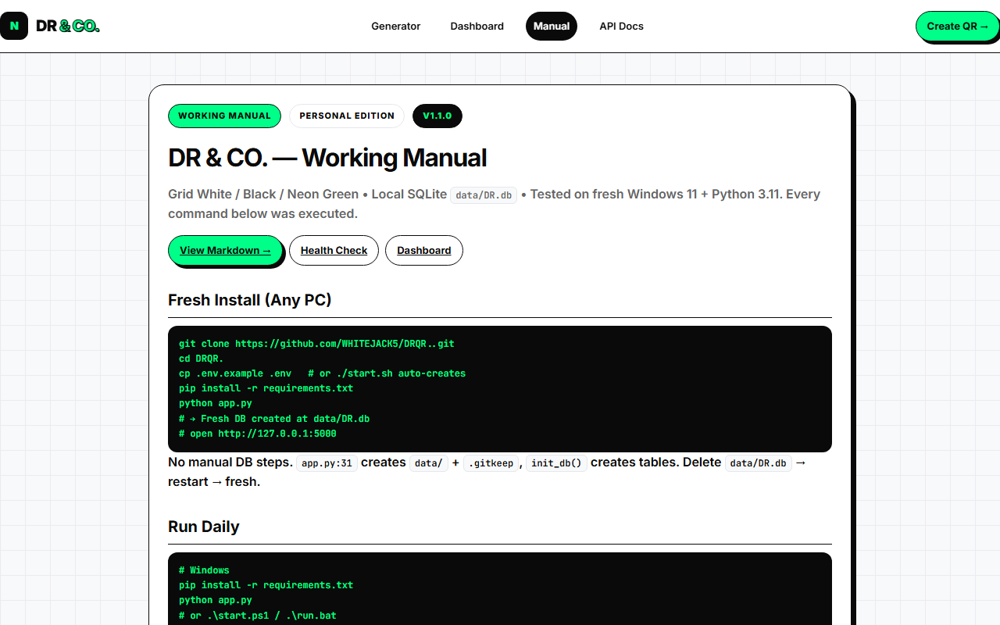

<div align="center">

# ⚡ DRQR — Dynamic QR Code Platform

[](https://github.com/WHITEJACK5/DRQR/actions)
[](https://github.com/WHITEJACK5/DRQR)
[](https://www.python.org/)
[](LICENSE)

**Production-grade, self-hosted QR code generation & analytics platform.**

[Quick Start](#-quick-start) · [Features](#-features) · [Architecture](#-architecture) · [API Docs](#-api-documentation) · [Deployment](#-deployment)

</div>

---

## 📸 Screenshots

<div align="center">



</div>


## 🎬 Demo Video

<video controls width="100%">
  <source src="docs/videos/demo.webm" type="video/webm">
  Your browser does not support the video tag.
</video>

```bash
# regenerate after UI changes
python scripts/capture_screenshots.py
```

---

## ✨ Features

### 🔐 Authentication & Security
- **JWT-based auth** — 15-minute access tokens with 30-day refresh tokens
- **Token rotation** — refresh tokens are rotated on every use
- **Redis-backed revocation** — compromised tokens invalidated before natural expiry
- **Email verification** — required before creating dynamic QR codes
- **2FA support** — TOTP-based two-factor authentication
- **Security headers** — CSP, X-Content-Type-Options, X-Frame-Options, HSTS
- **Rate limiting** — Redis-backed, per-IP, per-route
- **CSRF-safe** — no cookie-based auth; Bearer tokens only

### 📱 QR Code Generation
- **25+ QR types** — URL, vCard, WiFi, Email, SMS, WhatsApp, Event, Location, Text, Social Media, GS1, and more
- **Live preview** — real-time rendering with spinner
- **Logo overlay** — drag & drop PNG/JPG/WebP/SVG (≤5MB), centered with white rounded background
- **Full customization** — patterns (square/dots/rounded/gapped), eye styles, colors, gradients, frame CTA text
- **Templates** — save and reuse QR configurations
- **Bulk generation** — CSV upload (up to 3,000 codes), async processing via RQ

### 📊 Analytics
- **Scan tracking** — timestamp, IP, user agent, device, browser, OS, country, city
- **Geo-IP enrichment** — async background job (never blocks redirect)
- **Dashboard overview** — total scans, timeline, device breakdown, top QR codes
- **Per-QR analytics** — detailed scan history for each code
- **Review capture** — star rating + free text for `review`-type QRs
- **LLM sentiment** — async sentiment classification per review
- **Auto-summary** — "what customers are saying" generated summary

### 🏗️ Architecture
- **Layered design** — `routes/` → `services/` → `repositories/` → `models/`
- **Pydantic schemas** — explicit input/output validation for every endpoint
- **API versioning** — `/api/v1/*` with deprecated `/api/*` aliases
- **Background jobs** — RQ (Redis Queue) with thread fallback
- **Caching** — Redis read-through cache for previews and analytics
- **Object storage** — S3-compatible (AWS S3, Cloudflare R2, Backblaze B2)
- **PostgreSQL** — SQLAlchemy ORM with Alembic migrations
- **Connection pooling** — bounded pool with `pool_pre_ping`

---

## 🏛️ Architecture


The source of truth is [`docs/architecture.mmd`](docs/architecture.mmd) — GitHub renders it from there, so the diagram is reviewable text and cannot silently drift from the code.

**What each hop is for:**

| Hop | Why it exists |
|---|---|
| Client → CDN | TLS termination and static asset caching at the edge, so the app tier never serves a static file or negotiates TLS |
| CDN → nginx | `deploy/nginx.conf` is the only thing that talks to gunicorn. It sets `X-Forwarded-Proto`, which `app/security.py` reads to decide whether to send HSTS |
| nginx → gunicorn | `wsgi:application` is the production entrypoint. `app.run()` is dev-only and is never the container CMD |
| app → PostgreSQL | SQLAlchemy with a bounded pool (`pool_pre_ping`, dialect-specific sizing) |
| app → Redis | Rate limiting, token revocation, the job queue and the read-through cache — one store, shared across workers |
| app → S3 | Logos only. Local disk is not the system of record (Phase 3d) |
| RQ worker → Postgres/Redis | Background jobs (geo-IP enrichment, bulk CSV) run outside the request path so they cannot delay a redirect |

---

## 🚀 Quick Start

### Option A — Docker Compose (recommended)

```bash
git clone https://github.com/WHITEJACK5/DRQR.git
cd DRQR
cp .env.example .env
docker compose up --build
# → http://localhost:8000
```

Brings up app + PostgreSQL 16 + Redis + RQ worker. No manual steps beyond copying `.env.example`.

### Option B — Local development

```bash
python -m venv .venv && source .venv/bin/activate
pip install -r requirements.txt
cp .env.example .env
python server.py
# → http://localhost:5000
```

Uses SQLite at `data/DR.db` by default. Set `DATABASE_URL` to use PostgreSQL.

---

## 🔌 API Documentation

The OpenAPI spec is **generated from the Pydantic schemas** and served at:

```
/api/v1/openapi.json    ← machine-readable spec
/api/v1/docs            ← Swagger UI
```

It cannot drift from the code because it is built from the same models the routes validate against.

### Authentication

All endpoints except `/api/health`, `/api/register`, and `/api/login` require:

```
Authorization: Bearer <access_token>
```

Access tokens expire in **15 minutes**. Use `/api/refresh` with the refresh token to get a new pair.

### Core endpoints

| Method | Path | Description |
|---|---|---|
| `POST` | `/api/register` | Create account |
| `POST` | `/api/login` | Log in |
| `POST` | `/api/refresh` | Exchange refresh token for new pair |
| `POST` | `/api/logout` | Revoke current tokens |
| `GET` | `/api/me` | Current user |
| `POST` | `/api/generate` | Generate QR (static or dynamic) |
| `GET` | `/api/qrcodes?limit=50&offset=0` | List user's QRs |
| `GET` | `/api/qrcodes/<id>` | Get one QR |
| `PUT` | `/api/qrcodes/<id>` | Update QR |
| `DELETE` | `/api/qrcodes/<id>` | Delete QR |
| `GET` | `/api/qrcodes/<id>/analytics` | Per-QR scan analytics |
| `GET` | `/api/analytics/overview` | Account-wide analytics |
| `GET` | `/api/folders` | List folders |
| `GET` | `/api/templates` | List templates |
| `GET` | `/metrics` | Prometheus metrics |
| `GET` | `/api/health` | Health check |

---

## 📊 Observability

### Structured logging

Every log line is JSON. Fields passed via `extra=` are promoted to the top level, so they are queryable rather than greppable. Messages use `%s` templates, so a filtered-out DEBUG line is never built.

### Metrics

`GET /metrics` serves Prometheus text: request count, a latency histogram and an error counter, all labelled by **route template** (never by raw path — a label per QR id would grow without bound).

```yaml
# prometheus.yml
scrape_configs:
  - job_name: drqr
    static_configs:
      - targets: ["app:8000"]
```

### Error tracking (Sentry)

Backend and frontend both initialise Sentry, gated on a DSN:

```bash
SENTRY_DSN=https://<key>@o<org>.ingest.sentry.io/<project>
SENTRY_FRONTEND_DSN=https://<public-key>@o<org>.ingest.sentry.io/<project>
```

Without a DSN both are no-ops — no import error, no crash, no warning, because a missing DSN is the normal state for local development and CI. The backend sets `send_default_pii=False`: a QR's content can be a personal link, so Sentry must not receive request bodies.

**Not verified:** no event has reached a Sentry dashboard. The integration is wired and unit-tested; the end-to-end delivery needs your DSN.

### Uptime monitoring

Point any external monitor at `GET /api/health`. It returns `200` with `{"status":"ok",...}` only when the app is up, so a non-200 or a timeout is a real alert.

**UptimeRobot (free):** Add Monitor → HTTP(s) → URL `https://your-domain/api/health` → interval 5 minutes.

**BetterStack (free):** Add Heartbeat → URL `https://your-domain/api/health` → interval 1 minute.

**Not verified:** no monitor has been created, because that needs your UptimeRobot/BetterStack account. The health endpoint it would poll is tested and proven.

---

## 🧪 Tests & Coverage

```bash
pytest -q                                    # SQLite
TEST_DATABASE_URL=postgresql://… pytest -q   # + PostgreSQL legs
pytest -q --cov                              # + coverage, enforced threshold
```

**Coverage: 74.40%** (branch coverage over `app/`, `server.py`, `wsgi.py`) against a **70% floor** that fails the build.

The floor is deliberately below the measured value. Pinning it to the current number would fail the build the first time a line was legitimately added, which teaches a team to lower the floor rather than write tests. It is a ratchet, not a target — raise it as coverage genuinely improves.

Heavy suites, each with extra tooling and each run by its own CI step:

| Suite | Needs | What it covers |
|---|---|---|
| `tests/test_e2e_playwright.py` | `pip install playwright && playwright install chromium` | Real browser: register → verify from a real email → login → dynamic QR → scan → analytics |
| `tests/test_load_redirect.py` | k6 on PATH | The `/r/<code>` redirect under sustained load, against the thresholds in `loadtests/redirect.js` |

Run the load profile directly:

```bash
BASE_URL=http://127.0.0.1:8000 CODE=abc12345 k6 run loadtests/redirect.js
QUICK=1 … k6 run loadtests/redirect.js   # light profile for CI
```

---

## 🏗️ Deployment architecture

See [Architecture](#-architecture) above for the diagram and hop-by-hop explanation.

**Local development** uses the same topology with one command:

```bash
cp .env.example .env
docker compose up --build
```

which brings up app + PostgreSQL + Redis + the RQ worker.

---

## 🎨 Design System

- Grid White: `#F8F9FA` + `#E9ECEF` 32px
- Black: `#0A0A0A` / `#111111`
- Neon: `#00FF88` / `#39FF14` / `#00E676` glow `0 0 20px rgba(0,255,136,0.5)`

---

## 📝 Notes for Other Computers

- No `.env` needed for the SQLite path — the file creates itself and is migrated on first run.
- To reset the SQLite DB: delete `data/DR.db` → `python server.py` recreates it.
- To back up SQLite: copy `data/DR.db`. To back up PostgreSQL: see Backups above.

---

Built for **DR & CO.** — Personal edition, local-first, single-command fresh install.
